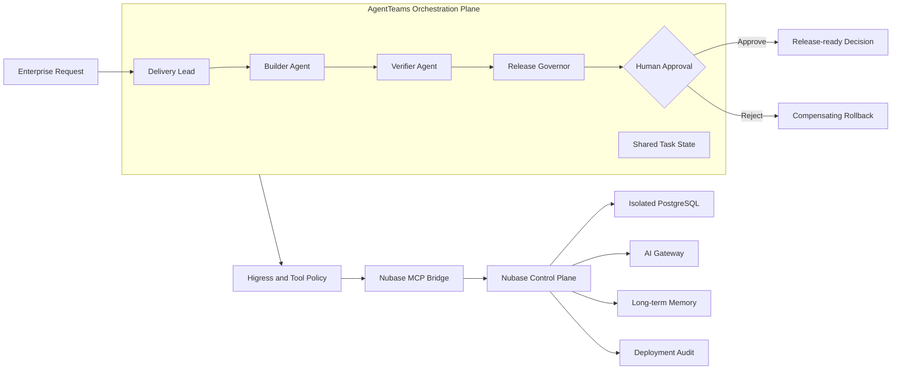

# GOAI Agent Infra Competition Design

Status: Accepted for implementation on `GOAI_dev`

## 1. Objective

本方案把 Nubase 作为 AgentTeams 的执行与治理基础设施，而不是重新实现一个多 Agent 框架。参赛场景是 **Nubase Agentic Delivery Team**：四个不同职能的 Agent 将一个 AI 应用从需求拆解推进到隔离环境部署、独立验证、人工发布就绪决策或补偿回滚，并留下可审计证据。

目标是覆盖大赛的核心要求：

- 以 AgentTeams 为协作设计基点；
- 至少三个职责不同且边界明确的 Agent；
- 每个 Agent 都有 Identity 和可复用 Skill；
- 采用已实现的 Nubase Memory 与 AgentTeams 共享任务状态，并提供可执行的 Trace 契约与证据门禁；
- 高风险操作必须经过人工审批；
- 失败必须进入明确状态，并提供回滚或补偿路径；
- 不在代码、配置、证据或演示产物中保存真实凭据。

非目标：

- 不重写 AgentTeams 的任务、消息和共享文件系统；
- 不把 Nubase Memory 当作实时工作流数据库；
- 不在本阶段把所有 Nubase 部署步骤包装成一个新的远程 MCP；
- 不宣称 SQL、Functions、Secrets 和 Memory 已支持完整自动回滚。

## 2. Existing Project and New Contribution Boundary

参赛前已经存在的 Nubase 能力：多租户控制面、独立 PostgreSQL、Auth、Storage、Functions、Assets、Cron、AI Gateway、Memory、HTTP MCP、本地 stdio MCP bridge、部署记录与部分回滚。

本分支新增的参赛贡献：

- AgentTeams v1.2.2 标准资源清单和 HiClaw v1.1.2 本机兼容清单；
- 四个 Agent Identity、四个角色化 Skill 和显式工具权限矩阵；
- 严格、无凭据的比赛包校验器与 MCP stdio smoke；
- 可执行的示例应用、共享状态、审批和 Trace 契约；
- MCP bridge 的 per-tool allowlist/denylist；
- 公开演示所需的 CORS、Docker 构建上下文、数据库暴露面和健康检查收口；
- 面向参赛包的 CI 与敏感信息扫描门禁。

Nubase 根许可证仍为 Apache-2.0。AgentTeams 是独立外部依赖，比赛材料中必须披露使用版本、许可证、运行边界及升级路径。

### 2.1 Toolchain and Compatibility

| Component | Version or range | License | Invocation and role |
| --- | --- | --- | --- |
| Nubase | `GOAI_dev` commit-pinned package | Apache-2.0 | Java HTTP MCP and TypeScript stdio bridge provide the execution/data plane |
| AgentTeams | v1.2.2, normative manifest | Apache-2.0 | Team/Worker orchestration, shared state, collaboration and human interaction |
| HiClaw | v1.1.2 compatibility marker; local CLI may report `dev` | Apache-2.0 | Runs the same four-role design through the legacy inline Team schema |
| Higress | Runtime-bundled; exact image version must be captured per real run | Apache-2.0 | Intended HTTP MCP routing, consumer authentication and exact tool allowlists |
| PostgreSQL + pgvector | PostgreSQL 15 image baseline | PostgreSQL License / PostgreSQL License | Isolated project data, RLS, migrations, vector memory and audit records |

Higress routes and runtime credentials are deliberately not provisioned by the Git package. Migrating from the local HiClaw compatibility run to AgentTeams v1.2.2 requires applying the four standalone Worker resources, creating the three reviewed Higress policies, injecting sandbox credentials at runtime, and re-running allow/deny probes. It does not require redesigning Identity, Skill, state, approval or evidence contracts.

## 3. Architecture



### 3.1 Source of Truth

| Information | Source of truth | Reason |
| --- | --- | --- |
| Task state, assignments, approval | AgentTeams shared task storage | 多 Agent 当前状态必须可协作和可恢复 |
| Long-term decisions and lessons | Nubase Memory | 跨运行复用，但不能驱动实时状态迁移 |
| Deployment steps and outcomes | Nubase deployment records | 与真实执行结果绑定 |
| SQL changes | `nubase.migrations` | 保存风险等级、Agent 和 Run 关联 |
| Model use, latency and cost | Nubase AI Gateway usage | 统一模型调用证据 |
| Human decision | Immutable approval artifact | 防止 Agent 自行提升权限 |

每次运行生成一个不可变 `runId`，并贯通任务状态、Agent 消息、MCP 调用、部署记录、迁移记录、审批文件和最终证据索引。

### 3.2 Agent Boundaries

| Agent | Primary responsibility | Mutation boundary |
| --- | --- | --- |
| Delivery Lead | 需求规范化、任务拆解、验收标准和风险分级 | 只读，不部署 |
| Builder Agent | 生成并部署到 sandbox/staging | 允许受控部署；禁止密钥、删除和危险 SQL |
| Verifier Agent | 独立验证 RLS、契约、运行结果和证据完整性 | 默认只读；只能调用 sandbox 验证接口 |
| Release Governor | 检查证据、请求人工审批、签发发布就绪决策或补偿回滚 | 只允许决策、状态查询与有限回滚；不能修改构建产物或执行 promote |

提示词中的边界不是唯一安全层。stdio bridge 同时使用 `NUBASE_ALLOWED_TOOLS`、`NUBASE_DENIED_TOOLS`、写操作开关以及 sandbox 项目凭据执行防御式限制。

## 4. Workflow State Machine

```text
intake
  -> planned
  -> building
  -> verifying
  -> awaiting_approval
  -> approved
  -> completed
```

失败分支：

```text
building | verifying
  -> blocked
  -> rollback_required
  -> rolled_back | blocked
```

状态迁移规则：

1. 只有 Delivery Lead 可以确认 `planned`。
2. Builder 不能写入 `approved` 或 `completed`。
3. Verifier 必须基于独立读取到的结果生成验证证据。
4. Release Governor 只能接受与当前 `runId`、artifact digest 和 verification digest 完全匹配的审批。
5. 高风险或不可逆动作没有有效人工审批时必须 fail closed。
6. 回滚不完整时必须保持 `blocked` 并在证据中标记 `PARTIALLY_COMPENSATED`，不得报告成功回滚。

首版审批状态契约映射到 AgentTeams shared state；真实运行必须在任务 workspace 中写入该状态。本分支不修改 Nubase deployment 数据库状态枚举，避免为了参赛引入不必要的持久化迁移。

## 5. Tool and Authentication Model

AgentTeams 通过 Higress 为 Worker 提供身份与 MCP 入口。真实 Nubase project key 只存在于网关或运行时 Secret 中，不写入 Worker Identity、Skill、YAML、共享状态、Trace 或 Git。

部署使用两条明确区分的路径：

- 本地 stdio bridge：提供 `deploy_app`，可读取本地目录、构建 Function bundle，并记录完整部署步骤；
- 远程 HTTP MCP：提供已经物化的 SQL、Function bundle、Asset、Cron、Memory 和 deployment inspection 原语，但当前没有远程 `deploy_app`。

因此比赛材料和 Demo 不得声称 AgentTeams 已经通过远程 HTTP MCP 调用了 `deploy_app`。真实执行必须标明 transport；无凭据验证只验证 schema、tool policy、stdio handshake 和本地 `sql_dry_run`。

## 6. Security and Failure Model

### 6.1 Security Controls

- 所有 Agent 使用专用 sandbox 项目，不使用生产数据和生产凭据；
- Tool discovery 和 dispatch 同时应用 allowlist；
- `project_keys`、`project_keys_admin`、密钥创建/删除和 secret 管理不分配给参赛 Worker；
- `NUBASE_ALLOW_DANGEROUS_SQL` 永远关闭；
- Manifest 禁止内嵌 secrets、禁用安全扫描、关闭验证或路径越界；
- Git、Docker build context、构建断言、运行时 Secret 和 CI 扫描组成多层泄密防线；
- Trace 只记录工具名、参数摘要、digest、状态和脱敏错误，不记录 header 或 response secret；
- 公共 Demo 默认不暴露 PostgreSQL，跨域 Cookie 必须显式来源白名单；
- AgentTeams/HiClaw 本地管理面只绑定 loopback，不能直接暴露到公网。

### 6.2 Failure Handling

| Failure | Response |
| --- | --- |
| Worker exits | AgentTeams 重试或重新分配；共享状态保持不变 |
| MCP timeout | 只对幂等读取自动重试；写操作先查询 deployment state |
| Partial deploy | 标记失败，阻止发布就绪决策，生成补偿计划 |
| Verification disagreement | Governor 阻断，交由人工裁决 |
| Approval digest mismatch | 拒绝发布并要求重新审批 |
| Trace write failure | fail closed；没有证据不能发布 |
| Memory unavailable | 继续当前运行，但不声称经验已沉淀 |

当前 Nubase 自动回滚只覆盖部分 Assets 和 Cron。SQL、Functions、Function Secrets 和 Memory 必须采用版本化、幂等变更或人工补偿，并在证据中如实标记。

## 7. Non-functional Requirements

- Reproducibility：固定 AgentTeams schema 版本、Node/pnpm/Java 版本和参赛 artifact digest；
- Reliability：所有 mutation 都有 idempotency 或可查询的执行状态；
- Security：提交和 artifact 扫描零真实 secret；默认最小权限；
- Observability：每个状态迁移和工具调用都有 `runId`、Agent、时间、结果和 digest；
- Performance：记录端到端耗时、任务等待、工具重试、TTFT、Token 和成本；
- Portability：AgentTeams v1.2.2 为规范版本，HiClaw v1.1.2 仅作为本机兼容运行；
- Maintainability：比赛集成集中在 `examples/goai-agent-delivery`，不污染业务模块边界。

## 8. Evaluation Plan

最小评测集覆盖：

1. 正常的 additive schema + versioned assets 部署；
2. 缺失 Identity 或 Skill 字段；
3. Manifest 未知字段和目录越界；
4. 内嵌 secret、私钥或 provider key；
5. 危险 SQL 和未启用 RLS；
6. 未授权 Worker 调用被过滤工具；
7. MCP 不可用和写调用不确定结果；
8. 验证失败后阻断审批；
9. 审批 digest 不匹配；
10. 部分回滚必须报告 `PARTIALLY_COMPENSATED`。

核心指标：任务成功率、人工介入率、验证阻断率、回滚恢复时间、p50/p95 端到端耗时、Token/成本、Trace 完整率。

## 9. Architecture Decisions

### ADR-001: AgentTeams owns orchestration

采用 AgentTeams 的 Team、Worker、共享任务和人工协作能力；Nubase 不复制这些能力。这样满足大赛要求，也保持控制面边界清晰。

### ADR-002: Memory and shared state are the two runtime context capabilities

首版运行能力采用既有 Nubase Memory 和 AgentTeams shared task state，满足上下文能力二选要求；本分支新增 Trace schema、validator 与 synthetic fixture，但在真实任务运行前不把 fixture 作为可观测实现证据。首版暂不加入 RAG，因为当前场景依赖运行事实和结构化交付物，增加知识库不会提高闭环正确性。

### ADR-003: Approval outside deployment persistence

审批先作为带 digest 的 AgentTeams artifact 实现。这样无需修改生产数据库 schema，同时能够证明人工门禁和审计链。

### ADR-004: Dual AgentTeams manifests

规范提交使用 AgentTeams v1.2.2；本机已安装的 HiClaw v1.1.2 使用独立兼容清单。兼容文件不得反向限制规范设计，升级后应删除运行时依赖而保留历史说明。

### ADR-005: Honest rollback semantics

任何未恢复的 SQL、Functions、Secrets 或 Memory 都必须标记为补偿回滚，而不是完整回滚。比赛演示优先使用 additive SQL 和 versioned resources，降低不可逆影响。

## 10. Acceptance Criteria

- 四个 Agent 均能从清单中创建，且只有一个 `team_leader`；
- 每个 Identity 和 Skill 均通过严格校验；
- 无凭据 MCP smoke 可以初始化、列出受控工具并执行本地 SQL 风险分类；
- 示例 Manifest 通过严格验证，恶意 fixture 被拒绝；
- 未授权工具既不会出现在 `tools/list`，也无法 dispatch；
- 人工审批缺失或 digest 不匹配时发布被拒绝；
- 所有证据可由 `git archive` 的跟踪文件重建，不读取 ignored 文件；
- Java/TypeScript 测试、Docker definition 检查、差异检查和敏感信息扫描通过；
- 本机 HiClaw compatibility apply 后四个角色处于可观察状态；
- Git 提交不包含 `.env`、`.nubase`、AgentTeams 运行态、日志、registry 或真实凭据。
