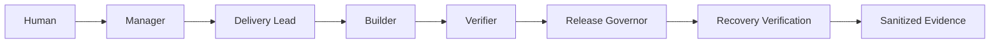

# GOAI Local Bounded Asset Closure Design

**Date:** 2026-08-11
**Status:** Accepted for local implementation
**Scope:** AgentTeams/HiClaw local contest demonstration on a dedicated disposable Nubase sandbox

## 目标

在不读取生产数据、不暴露凭据、不开放任意删除能力的前提下，真实走通以下角色链路：



演练必须产生真实 deployment record、真实 synthetic asset、独立验证、显式人类决定、真实 bounded rollback 和恢复证据。成功的 rollback drill 终态为 `REJECTED_RECOVERED`；不触发 rollback 的正向路径终态为 `APPROVED_FOR_PROMOTION` readiness。

## 非目标

- 不提供远程 `deploy_app`。
- 不提供或模拟 `deployment_promote`。
- 不执行 SQL、Schema、Function、Cron、Secret、Key、用户管理或生产写入。
- 不让 marker 进入生产 CDN、公开 object-store origin 或 Assets 公共数据面。
- 不把 readiness decision、marker stage 或恢复结论描述成整应用部署或已发布。
- 不验证 SQL、Function、Memory 或 Secret 的完整恢复能力。

## 运行架构

人类通过 Element/Matrix 向 Manager 提交任务。Manager 在 Team Room 中协调 Delivery Lead、Builder、Verifier 和 Release Governor。每个 Worker 通过自己的 `mcporter` Skill 访问 Higress 上对应的最小权限 MCP route：

| Role | MCP route | Purpose |
| --- | --- | --- |
| Delivery Lead | `nubase-read` | Read-only planning context |
| Builder | `nubase-build` | Bounded marker stage |
| Verifier | `nubase-read` | Service-role, metadata-only stage and recovery checks |
| Release Governor | `nubase-release` | Decision and bounded rollback |

HiClaw v1.1.2 的运行证据以 Worker 身份下的实际 `mcporter` discovery 和 call result 为准。CoPaw native MCP registry 计数、资源清单、URL 可达性和 Higress 配置写入结果都不是单独充分的授权证明。

## `deploymentStageAsset` 契约

Builder 只传递四个经过审查的字段：

| Field | Constraint |
| --- | --- |
| `appName` | `^[a-z][a-z0-9-]{2,63}$` |
| `taskId` | `^task-[a-z0-9][a-z0-9-]{5,63}$` |
| `runId` | `^run-[a-z0-9][a-z0-9-]{5,63}$` and unique for the run |
| `manifestDigest` | lowercase `sha256:` plus 64 hexadecimal characters |

Bounded stage 还有一组不可由 Builder 参数覆盖的运行环境门禁：

| Setting | Required state |
| --- | --- |
| `NUBASE_ASSETS_BOUNDED_PRIVATE_STORAGE_ENABLED` | Explicitly `true`; default is `false` |
| `NUBASE_ASSETS_BUCKET` | Empty, so production/public Assets CDN mode is disabled |
| `NUBASE_ASSETS_PUBLIC_BASE_URL` | Empty |
| `R2_PUBLIC_URL` | Empty |
| `R2_GLOBAL_BUCKET` | Dedicated private sandbox bucket |
| Bucket versioning | Enabled before the run |

该组合只允许显式选择的本地私有 backend mode。任一公开 origin、生产 CDN 配置、默认关闭状态或无法核验的 versioning 都使 bounded stage 失败关闭。

服务端固定执行以下步骤：

1. 创建 `bounded-asset-v1`、`java-http-mcp` deployment record。
2. 根据审查字段和服务端随机 `ownershipNonce` 生成不包含用户数据的 marker JSON；客户端不能预计算 marker bytes 或 artifact digest。
3. 固定目标为 `__goai_e2e/{runId}/marker.json`。
4. 验证显式 private-storage 开关、三个公开/CDN 配置均为空，并确认目标 bucket 已预先启用 versioning；任一条件失败时按失败关闭。
5. 以 `upsert=false` 上传 marker，禁止覆盖既有对象。
6. 成功写入必须取得非空 `ownershipVersionId`，并在真实 `assets_upload` succeeded step 中与 artifact digest、size、ETag 一起记录。客户端只接受 lowercase SHA-256 digest，并要求 stage response、deployment summary 和 step 三方完全一致；size 必须是合理范围内的正整数且与 step、`assetsList` marker 三方一致。
7. 成功响应返回 `deploymentId`、status、path、artifact digest、size、ETag 和同一个 `ownershipVersionId`；失败响应只返回 bounded error code 与允许的脱敏状态字段。
8. Marker DTO 和 deployment record 的 `publicUrl` 保持为空，不生成或持久化公开访问地址。

Builder 不能提供任意 path、任意内容或 `upsert` 参数。该组合工具避免开放通用 deployment step 记录能力，防止伪造 target 后借 Governor rollback 删除其他资源。

Private access 和 bucket versioning 都是运行环境的显式前置条件，不是应用管理能力。Nubase 不调用 bucket public-access、versioning enable、suspend 或更新接口，避免在共享 object store 上产生越权的控制面副作用。

## Reserved namespace visibility

`__goai_e2e` 采用多层不可见边界：

- `assets.files` 的 anon/authenticated SELECT RLS policy 排除 reserved root 与其子路径；
- 通用 Assets list/get 对 reserved path 返回空或 not-found，不读取 marker metadata；
- `/assets/v1/**` 公共 GET、HEAD 与 SPA fallback 不能返回 reserved marker；
- marker DTO 不生成 `publicUrl`，deployment record 也保持 `publicUrl=null`；
- service-role Verifier 可通过受控 `nubase-read.assetsList` 读取 path、digest、size、ETag 等脱敏 metadata，用于 stage/recovery 验证，但不能读取 marker body。

Service-role 可见性是验证专用例外，不是公开或 authenticated 可读能力，也不能用于生成公开链接。

## 状态与决策

### 正向 readiness

1. Delivery Lead 固定 `taskId`、唯一 `runId`、manifest digest 和验收契约。
2. Builder 通过 `mcporter` 证明 `deploymentStageAsset` 可见，并只调用一次。
3. Verifier 使用 service-role `deploymentStatus`、`deploymentLogs` 和 `assetsList` 独立验证 marker 与 evidence，要求成功响应和 `assets_upload` step 的 `ownershipVersionId` 完全一致且 marker/deployment 不含 public URL；anon/authenticated RLS 与公共 GET/HEAD/SPA negative checks 必须通过。
4. 人类决定与 manifest/verification digest 绑定。
5. Release Governor 在独立 `PASS` 和批准同时存在时输出 `APPROVED_FOR_PROMOTION`。

`APPROVED_FOR_PROMOTION` 只表示当前 artifact 满足 readiness gate。因为没有 `deployment_promote`，部署状态保持不变，任何证据都不得写成 promoted 或 released。

### Rollback drill

1. Acceptance contract 显式设置 `rollbackDrill`，并固定 deployment、marker path 和 approval boundary。
2. Builder 完成 bounded stage。
3. Verifier 先证明 stage 正常，再记录 `ROLLBACK_DRILL_INJECTED`，明确这是受控演练触发器而非真实业务故障。
4. Release Governor 校验失败报告和人类 rollback approval 后，只调用一次 `deploymentRollback`。
5. Rollback service 只允许按当前 `bounded-asset-v1` deployment 的精确 marker path、ETag 和 `ownershipVersionId` 删除该对象版本，不得对 path 执行无版本删除。
6. Verifier 独立证明 marker 不存在、deployment status 为 `rolled_back`，且唯一成功 action 的 operation 为 `asset_version_deleted`、`ownershipVersionId` 与 stage/step 完全一致。
7. Release Governor 输出 `REJECTED_RECOVERED`。

`partially_rolled_back`、`rollback_failed`、`running` 或未知 status 都必须转为 `BLOCKED`，保留当前状态并进入人工补偿；不得输出 `REJECTED_RECOVERED`，也不得循环重试 rollback。

## Evidence 契约

Manager 只把脱敏材料汇总到 `/host-share/{runId}`。建议文件集合：

- `task-spec.md`
- `delivery-plan.md`
- `acceptance-contract.md`
- `build-manifest.json`
- `build-evidence.json`
- `verification-report.json`
- `recovery-verification-report.json`
- `approval.json`
- `release-decision.json`
- `rollback-report.json`
- `task-state.json`
- `trace.jsonl`
- `checksums.sha256`
- `retrospective.md`

证据允许保存 tool name、route name、timestamp、bounded status/error code、deployment ID、marker path、digest、size、ETag、非秘密 `ownershipVersionId`、`markerPublicUrlAbsent=true`、HTTP status class 和决策。`build-evidence.json` 与 `rollback-report.json` 必须保存同一个 `ownershipVersionId`，后者还必须保存 `asset_version_deleted` action。不得保存认证头、Token、API Key、Cookie、raw control-plane configuration、marker 原文、marker public URL、用户数据、数据库内容、完整工具响应或 Agent runtime state。

所有事件必须关联相同 `taskId` 和 `runId`，并记录实际 `agentId`。`release-decision.json` 必须绑定 manifest digest、independent verification digest 和 human decision。

## Failure Handling

- Discovery 缺失、route offline 或策略不精确时，在任何写操作前 `BLOCKED`。
- Private-storage 开关仍为默认 `false`，任一 Assets/R2 public origin 非空，或目标不是专用私有 backend bucket 时按失败关闭；生产 CDN 模式不得降级执行 bounded stage。
- Bucket versioning 未启用或无法核验时，在写入前失败关闭；不得由应用自动修改 bucket versioning 以绕过门禁。
- `deploymentStageAsset` timeout 后，只有存在可信 `deploymentId` 时才能查询状态；不得用相同 `runId` 盲目重试。
- Stage 返回 bounded error code 时只保存 code，不保存异常堆栈或原始响应。
- Recovery verification 失败时停止自动化，由人类运行独立补偿手册。
- SQL、Function、Secret 和 Memory 不属于本 profile；若证据出现这些 step，Governor 必须拒绝 bounded success claim。

## 关键决策与权衡

### ADR-001: Server-side composite stage

选择服务端组合工具而不是向 Builder 开放 `deploymentCreate`、`deploymentRecordStep` 和 `deploymentComplete`。组合工具牺牲通用性，换取真实 step、固定 target、禁止覆盖和 rollback target 约束，避免 confused-deputy 删除风险。

### ADR-002: One synthetic asset

演练只创建一个 synthetic marker。它不足以证明整应用交付能力，但能以最小副作用真实验证多 Agent 编排、MCP 授权、deployment evidence、人工门禁和 rollback。

### ADR-003: Readiness is not release

保留 `APPROVED_FOR_PROMOTION` 与实际 promote 之间的明确边界。没有独立 `deployment_promote` 工具时，Governor 不得改变发布状态。

### ADR-004: `mcporter` is runtime evidence

清单和网关配置属于期望状态。只有 Worker 自身通过 `mcporter` 发现并调用工具，才能证明角色实际获得 MCP 能力。

### ADR-005: Version-bound ownership proof

ETag 只能帮助识别对象内容，不能在覆盖竞态下唯一指向一个历史对象版本。闭环要求 object store 预先启用 versioning，并把服务端返回的 `ownershipVersionId` 贯穿 stage response、deployment step、build evidence、rollback action 和 rollback evidence。Rollback 只删除该版本，避免误删同一路径后来出现的替代对象。应用只核验 versioning，不修改共享 bucket 的控制面配置。

### ADR-006: Private-by-explicit-opt-in

通用 Assets 默认可以运行在公开 CDN 模式，因此不能仅凭 reserved path 推断 marker 私有。Bounded stage 增加默认关闭的显式 private-storage 开关，并要求 `NUBASE_ASSETS_BUCKET`、`NUBASE_ASSETS_PUBLIC_BASE_URL`、`R2_PUBLIC_URL` 全空；只有专用私有 global bucket 才能开启。数据面继续通过 RLS、通用 API filtering、公共 GET/HEAD/SPA hiding 和空 `publicUrl` 防止意外公开，service-role Verifier 只获得受控 metadata view。

## 验证

静态和单元验证应至少包括：

```bash
node examples/goai-agent-delivery/scripts/validate-package.mjs
node examples/goai-agent-delivery/scripts/test-validator.mjs
node examples/goai-agent-delivery/scripts/run-local-closure.mjs \
  --evidence-root "$(pwd)/examples/goai-agent-delivery/evidence/local-sandbox" \
  --approve-local-rollback
bash script/goai/test-install-agentteams.sh
./mvnw -q -Dtest=BoundedAssetDeploymentServiceTest,DeploymentsMcpToolsTest,AppDeploymentRollbackServiceTest,McpConfigTest,RemoteAdminMcpToolsTest test
git diff --check
```

运行时验证必须在专用 sandbox 上完成以下事实检查：

- 四个 Worker 的 `mcporter` server status 为 `ok`。
- 实际 tool inventory 与 policy 完全相等。
- Builder 能调用 `deploymentStageAsset`，但不能调用 `executeSql`、删除、Secret、Key 或 rollback 工具。
- Release Governor 能调用 `deploymentRollback`，但不能调用 stage、构建、SQL、Secret 或 Key 工具。
- Private-storage 开关显式开启，三个 public/CDN 配置为空，global bucket 私有且 versioning enabled；生产 CDN 配置的 stage 请求按失败关闭。
- Anon/authenticated RLS、通用 list/get、公共 GET/HEAD 和 SPA fallback 均隐藏 reserved marker；service-role `assetsList` 只返回无 `publicUrl` 的脱敏 metadata。
- 正向演练只产生 `APPROVED_FOR_PROMOTION` readiness。
- Rollback drill 产生 `REJECTED_RECOVERED`，且 marker 确实不存在。
- Stage response、`assets_upload` step、build evidence、`asset_version_deleted` action 和 rollback evidence 使用完全相同的 `ownershipVersionId`。
- Evidence tree 通过敏感内容扫描，且不包含 raw configuration 或 credential material。
